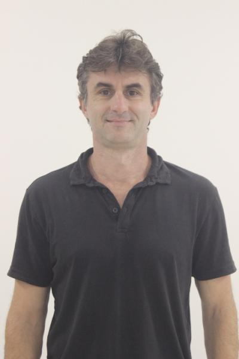

# *Professor*

<!--Diferentes formas de ajustar o tamanho da imagem-->
<!--
{:class="img-responsive"}
{:height="50%" width="50%"}
{:height="700px" width="400px"}-->
<!---->

{:class="img-responsive":height="50%" width="50%"}

## Info

* [emilson@ige.unicamp.br](mailto:emilson@ige.unicamp.br)
* [+55 19 3521-4572](tel:%2B55193521-4572)
* Room 343
* [Website](https://portal.ige.unicamp.br/docente/emilson-pereira-leite)
* [Curriculum Lattes](http://lattes.cnpq.br/6990571435444630)
* [Google Scholar](https://scholar.google.com.br/citations?hl=pt-BR&oi=ao&user=0lrDQg8AAAAJ)

## About

Professor of the [ige_unicamp_en] at the [unicamp_en], Brazil.

## Biography

Professor Doutor MS-3.2 do Departamento de Geologia e Recursos Naturais do Instituto de Geociências da UNICAMP. Graduado em Geofísica pela Universidade de São Paulo (1997), mestre em Geofísica pela Universidade de São Paulo (2000) e doutor em Geofísica pela Universidade de São Paulo (2005), tendo realizado estágio no Departamento de Ciências Espaciais e da Terra e Engenharia da Universidade de York, Canadá. Tem experiência na área de Geofísica e atua principalmente nos seguintes temas: inversão de dados geofísicos; estudos geofísicos de estruturas de impacto; integração de dados geofísicos, de sensores remotos e geológicos aplicada à exploração mineral e de hidrocarbonetos.

## Linhas de Pesquisa:
* [Geotecnologias aplicadas ao estudo dos recursos naturais](https://portal.ige.unicamp.br/linha-de-pesquisa/geotecnologias-aplicadas-ao-estudo-dos-recursos-naturais)

## Áreas de Interesse:
* [Geofísica Aplicada](https://portal.ige.unicamp.br/areas-de-interesse/geofisica-aplicada)
