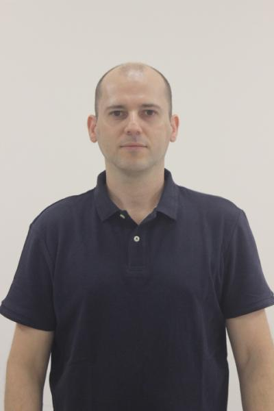

# *Professor*

{:class="img-responsive":height="50%" width="50%"}

## Info

* [gelvam@ige.unicamp.br](mailto:gelvam@ige.unicamp.br)
* [+55 19 3521-4572](tel:%2B55193521-4572)
* Room 343
* [Website](https://portal.ige.unicamp.br/docente/gelvam-andre-hartmann)
* [Curriculum Lattes](http://lattes.cnpq.br/6186195219221290)
* [Google Scholar](https://scholar.google.com.br/citations?hl=&user=kCka2CwAAAAJ)
* [ORCID](https://orcid.org/0000-0001-6078-3893)

## About

Professor of the [ige_unicamp_en] at the [unicamp_en], Brazil.

## Biography

Professor doutor no Departamento de Geologia e Recursos Naturais do Instituto de Geociências, Universidade Estadual de Campinas. Possui graduação em Física (2001), mestrado (2005) e doutorado (2010) em Geofísica pela Universidade de São Paulo, com estágio sanduíche durante o doutorado no Institut de Physique du Globe de Paris. Efetuou dois estágios de pós-doutorado em Geofísica na Universidade de São Paulo (2013) e no Observatório Nacional (2016). Desenvolve pesquisas em geomagnetismo, arqueomagnetismo, paleointensidade, magnetismo ambiental e magnetismo de rochas.

## Linhas de Pesquisa:
* [Geotecnologias aplicadas ao estudo dos recursos naturais](https://portal.ige.unicamp.br/linha-de-pesquisa/geotecnologias-aplicadas-ao-estudo-dos-recursos-naturais)

## Áreas de Interesse:
* [Arqueomagnetismo](https://portal.ige.unicamp.br/areas-de-interesse/arqueomagnetismo)
* [Geomagnetismo](https://portal.ige.unicamp.br/areas-de-interesse/geomagnetismo)
* [Magnetismo Ambiental](https://portal.ige.unicamp.br/areas-de-interesse/magnetismo-ambiental)
